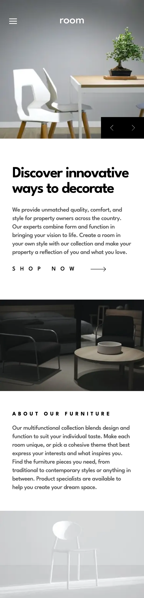
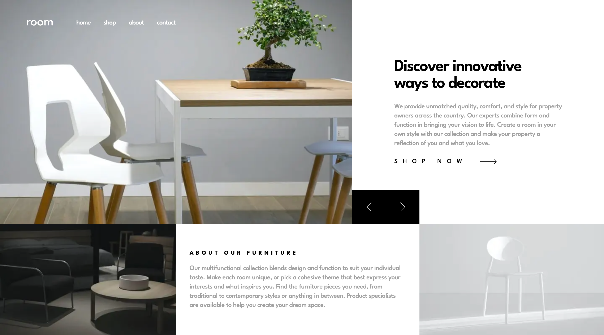

# Room Homepage

A responsive landing page built from a Frontend Mentor design, featuring a CSS-forward horizontal slider with native scrolling, scroll snapping, and JavaScript navigation controls.

## Overview

This project is a responsive implementation of the [Frontend Mentor Room homepage challenge](https://www.frontendmentor.io/challenges/room-homepage-BtdBY_ENq).

The slider uses native horizontal scrolling and CSS scroll snapping to support touch and trackpad interaction. JavaScript provides additional navigation through the previous and next buttons, while an `IntersectionObserver` helps manage the accessibility of slides as their visibility changes.

The project uses a CUBE CSS-inspired organization to separate styles into distinct layers and uses Sass partials to organize the stylesheet.

## Features

- Responsive layouts for mobile and desktop screen sizes.
- Horizontal slider using Flexbox, overflow management, and CSS scroll snapping.
- Touch, trackpad, and button-based slide navigation.
- Previous and next controls positioned before the slides in the keyboard focus order.
- `IntersectionObserver` to identify slides that are sufficiently visible in the scroll container.
- `inert` applied to slides that are less than 60% visible, reducing unintended keyboard interaction with offscreen content.
- Live region that announces the current slide position, such as "Showing slide 2 of 3."
- Responsive navigation menu.
- Keyboard-accessible interactive elements.
- Semantic HTML and responsive CSS.

## Screenshots

|        Mobile designed at 375px:         | Desktop designed at 1440px:               |
| :--------------------------------------: | ----------------------------------------- |
|  |  |

## Links

- [Solution URL](https://github.com/elisilk/room-homepage)
- [Live Site](https://elisilk.github.io/room-homepage/)

## Built With

- Semantic HTML5 markup
- CSS custom properties
- Flexbox
- CSS Grid
- CSS scroll snapping
- JavaScript
- `IntersectionObserver`
- `inert`
- Sass partials
- CUBE CSS organization
- Mobile-first workflow

## Technical Highlights

### Native scrolling and scroll snapping

The slider uses a horizontally scrollable Flexbox layout with CSS scroll snapping rather than relying on a dedicated carousel library.

This approach supports native touch and trackpad interaction while providing a lightweight foundation for the slider controls.

The previous and next buttons use `scrollIntoView()` to navigate to the appropriate slide. Using the browser's native scrolling API avoids relying on manually calculated element positions and provides more consistent alignment across viewport sizes and devices.

### Managing slide visibility and keyboard interaction

The slider uses an `IntersectionObserver` to monitor how much of each slide is visible within the scrollable area.

Slides that are less than 60% visible receive the `inert` attribute. This helps prevent keyboard users from moving into links and other interactive content that is not sufficiently visible in the current slider view.

The implementation also includes a live region that announces the current slide position, helping communicate changes in the slider's state.

### CSS organization

The project uses a CUBE CSS-inspired organization to separate styles into different responsibilities, including global styles, compositions, utilities, and blocks.

Sass partials are used to organize the stylesheet into these categories. The project focuses primarily on using the organizational structure rather than relying on complex Sass features.

## Accessibility and Responsive Considerations

Accessibility and responsive behavior were considered throughout the implementation.

Areas of focus include:

- Semantic HTML and meaningful document structure.
- Keyboard access to interactive controls and links.
- Focus order that prioritizes the slider controls before the slide content.
- Reducing keyboard access to slides that are not sufficiently visible.
- Announcing the current slide position through a live region.
- Responsive layouts across mobile and desktop screen sizes.
- Maintaining touch and trackpad scrolling alongside button navigation.
- Checking color contrast and accessible labeling for interactive elements.

The slider interaction was refined after testing revealed that keyboard navigation could move focus from a visible slide's primary link to a link in another slide. The implementation was updated to manage inactive slide content using `IntersectionObserver` and `inert`.

## Development Process

The project involved translating a supplied design into a responsive frontend implementation while making implementation decisions around layout, image presentation, navigation, and accessibility.

Additional development considerations included:

- Responsive image sizing and positioning.
- Typography and spacing across viewport sizes.
- Accessible labeling for standalone and decorative SVG icons.
- Color contrast adjustments where the supplied design did not meet accessibility requirements.
- Testing interaction through keyboard navigation, touch gestures, trackpad scrolling, and slider controls.

## Continued Development

Potential future improvements include:

- Further refinement of slide transitions and animations.
- Additional testing with assistive technologies.
- Continued review of keyboard interaction across browsers and devices.
- Further refinement of image positioning and spacing at intermediate viewport sizes.

## Author

- [Frontend Mentor](https://www.frontendmentor.io/profile/elisilk)
- [GitHub](https://github.com/elisilk)
