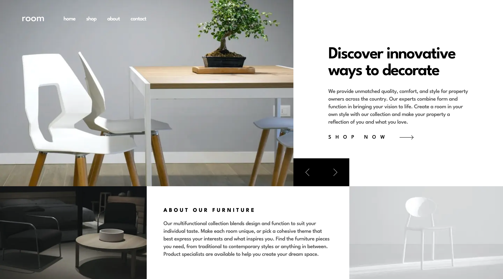

# Frontend Mentor - Room homepage solution

This is a solution to the [Room homepage challenge on Frontend Mentor](https://www.frontendmentor.io/challenges/room-homepage-BtdBY_ENq). Frontend Mentor challenges help you improve your coding skills by building realistic projects.

## Table of contents

- [Overview](#overview)
  - [The challenge](#the-challenge)
  - [Screenshots](#screenshots)
  - [Links](#links)
- [My process](#my-process)
  - [Built with](#built-with)
  - [What I learned](#what-i-learned)
  - [Continued development](#continued-development)
  - [Useful resources](#useful-resources)
- [Author](#author)

## Overview

### The challenge

Users should be able to:

- View the optimal layout for the site depending on their device's screen size
- See hover states for all interactive elements on the page
- Navigate the slider using either their mouse/trackpad or keyboard

### Screenshots

|        Mobile designed at 375px:         | Desktop designed at 1440px:               |
| :--------------------------------------: | ----------------------------------------- |
|  |  |

### Links

- Solution URL: [https://github.com/elisilk/room-homepage](https://github.com/elisilk/room-homepage)
- Live Site URL: [https://elisilk.github.io/room-homepage/](https://elisilk.github.io/room-homepage/)

## My process

### Built with

- Semantic HTML5 markup
- CSS custom properties
- Flexbox
- CSS Grid
- Mobile-first workflow
- Accessibility
- CUBE CSS
- Sass

### What I learned

So many cool 😎 things. Resources I used:

- PageSpeed Insights and Lighthouse Scores
  - Current solution - [PageSpeed Insights Report from Jan 5, 2025, 2:18:39 PM](https://pagespeed.web.dev/analysis/https-elisilk-github-io-room-homepage/j2mugffcew)
  - Initial solution - [PageSpeed Insights Report from Jan 5, 2025, 1:41:52 PM](https://pagespeed.web.dev/analysis/https-elisilk-github-io-room-homepage/zbvq0hpzy0)
- [Fluid typography and spacing](https://royalfig.github.io/fluid-typography-calculator/)
- [transfonter](https://transfonter.org/) - to convert [Google Font of League Spartan](https://fonts.google.com/specimen/League+Spartan) into a woff2 compressed form.
- [`cwebp` command-line tool](https://web.dev/articles/serve-images-webp) - to convert JPEG images to the more modern, compressed WebP format.
- [WAVE (web accessibility evaluation tool)](https://wave.webaim.org/report#/https://elisilk.github.io/room-homepage/) - Helped identify issues with contrast and id labels.
- [Contrast Checker](https://webaim.org/resources/contrastchecker/) - The color constrast between the Dark Gray (#A0A0A0 / hsl(0, 0%, 63%)) text color (used in the main text areas) and the white background was not sufficient to pass the Web Content Accessibility Guidelines (WCAG). So I decided to go against the design and change the text color to the lightest gray color that does pass, which is #595959 / hsl(0,
  0%,
  35%).
- [Accessible SVG Icons](https://css-tricks.com/accessible-svg-icons/) - Made sure to indicate when an SVG icon is stand-alone and so needs a title to communicate its purpose. Versus when it has an accompanying text label and so is only decorative.
- [`preload`](https://developer.mozilla.org/en-US/docs/Web/HTML/Attributes/rel/preload) - Still learning about how preloading works, how to implement it, and when it's effective, especially as relates to fonts (but also images).
  - [Best practices for fonts](https://web.dev/articles/font-best-practices)
  - [Preload critical assets to improve loading speed](https://web.dev/articles/preload-critical-assets)
  - [Preload web fonts to improve loading speed](https://web.dev/articles/codelab-preload-web-fonts)
- [A Quick Overview of `object-fit` and `object-position`](https://css-tricks.com/on-object-fit-and-object-position/) - Still trying to master how to use `object-fit` and `object-position` so that the images are resized in ways that work as the viewport is resized and are consistent with the intent of the design.
- [CSS-Only Carousel](https://css-tricks.com/css-only-carousel/) - I love the CSS-only carousel rather than some heavier JavaScript implementation. However, although scrolling is an option, I did use JavaScript for the buttons as an enhancement.
  - [`scrollTo()`](https://developer.mozilla.org/en-US/docs/Web/API/Element/scrollTo)

### Continued development

Specific areas that the solution should be improved (known issues):

- Fix issues raised by [@JosielLima's feedback on the solution](https://www.frontendmentor.io/solutions/homepage-with-lightweight-scrollable-slider-MNlW0cZQZK)
  - Add animations/transitions between the slides
  - Consider an alternate solution approach to the carousel
- Fix block spacing for the slide text of solution compared to the design. In the design the start spacing is less than the end spacing, both in the desktop and mobile views.
- Hide the horizontal scrollbars on the slider.
  - [Using CSS to hide scrollbars without impacting scrolling](https://blog.logrocket.com/hide-scrollbar-without-impacting-scrolling-css/)
- Prevent the slider from moving to a new slide when the tab button is pressed so the focus does not shift from one of the "Shop now" links to the next. A promising solution idea is to dynamically set `tabindex="-1"` for slides that are not visible in the current viewport.
  - [Control focus with tabindex](https://web.dev/articles/control-focus-with-tabindex)
  - [Can I dynamically set tabindex in JavaScript?](https://stackoverflow.com/questions/3772438/can-i-dynamically-set-tabindex-in-javascript)
  - [Element: `getBoundingClientRect()` method](https://developer.mozilla.org/en-US/docs/Web/API/Element/getBoundingClientRect)
  - [Intersection Observer API](https://developer.mozilla.org/en-US/docs/Web/API/Intersection_Observer_API)
  - [The Intersection Observer API explained](https://pawelgrzybek.com/the-intersection-observer-api-explained/)
  - [How can I tell if a DOM element is visible in the current viewport?](https://stackoverflow.com/questions/123999/how-can-i-tell-if-a-dom-element-is-visible-in-the-current-viewport)

More general ideas I want to consider:

Hmm 🤔 ...

### Useful resources

- [Kevin Powell on YouTube](https://www.youtube.com/@KevinPowell) - He's the best.
- [Accessibility Developer Guide](https://www.accessibility-developer-guide.com/)
- [MDN Web Docs for CSS](https://developer.mozilla.org/en-US/docs/Web/CSS) - Went here a lot to reference the different CSS properties and the shorthands, and all the great explanations about best practices.
- [The Clamp Calculator](https://royalfig.github.io/fluid-typography-calculator/) - Used for all of fluid typography and fluid spacing calculations. I didn't end up using it in this solution, but it's always there when I need it.

## Author

- Website - [Eli Silk](https://github.com/elisilk)
- Frontend Mentor - [@elisilk](https://www.frontendmentor.io/profile/elisilk)
